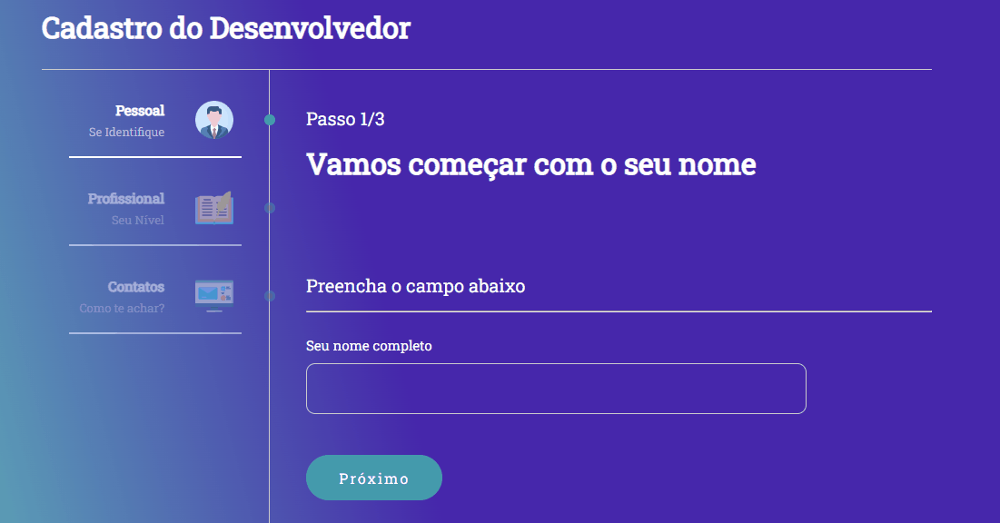

# MultForm

Um formulário multi etapas criado em React usando ContextAPI seguindo orientações do professor Bonieky Lacerda, a aplicação recolhe os dados do usuário 
em 3 telas com uma mesma estrutura e os adiciona em uma Context que salva as informações.  
A ideia é aprender a criar uma forma mais intuitiva de cadastro, então não há o envio desses dados para uma API
  

✅ Verificação de formulários 
✅ Poder navegar livremente entre as páginas sem perder dados já salvos

 

## Dependencies 🚀

✅ React 
✅ React-dom 
✅ React-router 
✅ Styled-components
